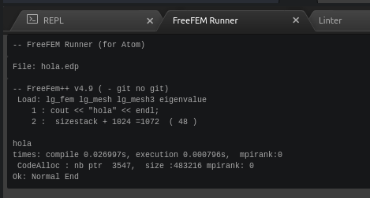

# Actividades con FreeFEm++. EDP y Métodos Numéricos

FreeFEm++ un lenguaje y un motor para la resolución de EDP mediante el
MEF. Sitio web: <https://doc.freefem.org/>

## Instalación

- FreeFEm++ tiene licencia libre. Puede instalarse de la forma habitual en sistemas operativos Windows, Mac y GNU/Linux. Ver <https://doc.freefem.org/introduction/installation.html>. El lenguaje FreeFEm++ está inspirado en C/C++. Suele almacenarse en ficheros con la extensión `.edp` y es ejecutado por el intérprete FreeFEm++ (el programa FreeFEm++ instalado).

    - Además de FreeFEm++, se necesita instalar un editor que permita escribir programas en este lenguaje. Por ejemplo, se recomienda instalar [Atom, un editor de código abierto](https://atom.io/) que está disponible para los sistemas operativos habituales. Vamos a ver cómo puede integrarse con FreeFEm++:

    - Una de las características de Atom es su capacidad para ser extendido mediante paquetes. Ver [más información en su página web](https://flight-manual.atom.io/using-atom/sections/atom-packages/). Esta página puede ser un buena lectura para aprender el proceso para la instalación de los paquetes que se comentan a continuación. En concreto, podemos instalar paquetes que le permitan (1) reconocer y colorear la sintaxis de FreeFEm++ y (2) utilizar FreeFEm++ para ejecutar el código que está siendo editado. En concreto:
      - `language-freefem-official`: paquete para la integración del
        lenguaje en Atom, en particular coloreado de la sintaxis
      - `freefem-runner`: para ejecutar ficheros (con la extensión `.epp`) desde el editor
        - Para ejecutar código FreeFEm++ usando `freefem-runner`, puede ser conveniente añadir la carpeta donde está situado el intérprete de FreeFEm++ a la variable `PATH` del sistema. Especialmente en sistemas Windows. Se puede encontrar [más información, por ejemplo, en la web de Microsoft](https://docs.microsoft.com/es-es/previous-versions/office/developer/sharepoint-2010/ee537574(v=office.14)/)
        - Si el proceso de instalación funcionó correctamente, puede ejecutarse el código FreeFEm++ contenido en un fichero `.edp` mediante la siguiente secuencia del menú `Packages`: `FreeFEM Runner`, `Launch compilation`.
        - Por ejemplo, al ejecutar el siguiente programa:
        ```C++
        cout << "hola" << endl;
        ```
        Se abrirá una ventana en la zona inferior similar a la siguiente, donde se ofrece información sobre la ejecución del programa.
        

## Primer ejemplo: Problema de Poisson con condiciones Dirichlet

- Como primer ejemplo, resolveremos la EDP de Poisson con condiciones de contorno Dirichlet:
$-\Delta u = f$  en  $\Omega$,
$u = 0$  sobre  $\Omega$.
- Podemos ver el código en el fichero <https://github.com/rrgalvan/edpymn/blob/main/src/freefem%2B%2B/0_poisson.edp> para el caso en en el que $\Omega$ es el intervalo unidad, $(0,1)^2$ y $f=4$ (con lo que la solución exacta es $u(x,y)=x(x-1)y(y-1)$).
- Uno de los puntos fuertes de FreeFEm++ es su excelente documentación, a la que se puede acceder en versión web directamente desde su web, <https://doc.freefem.org/documentation/> (también en [versión PDF](https://github.com/FreeFem/FreeFem-doc/raw/pdf/FreeFEM-documentation.pdf)). Aconsejamos detenerse a estudiarla a quien esté interesado en adquirir conocimientos en el lenguaje y en general en los métodos de elementos finitos.
- Es particularmente interesante la sección *Learning by Examples". En ella puede encontrarse el ejemplo anterior (ecuación de Poisson con condiciones de contorno Dirichlet homogéneas), pero para el caso en el que el dominio $\Omega$ es el círculo unidad y $f(x,y)=xy$: <https://doc.freefem.org/tutorials/poisson.html>
- En la parte final de este ejemplo se comenta cómo acceder al sistema de ecuaciones (matriz y segundo miembro) subyacentes al método de los elementos finitos (y, en general, a los métodos de Galerkin).

## Segundo ejemplo: Problema de Poisson con condiciones Dirichlet/Neumann
- En <https://doc.freefem.org/tutorials/membrane.html> se puede ver un ejemplo en el que se resuelve el problema de Poisson pero con condiciones de contorno mixtas Dirichlet/Neumann en distintas partes de la frontera, $\Gamma_1$ y $\Gamma_2$.
